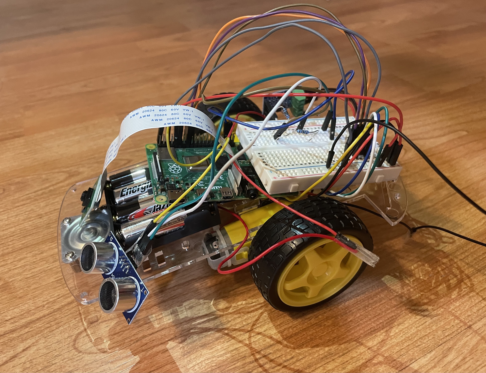
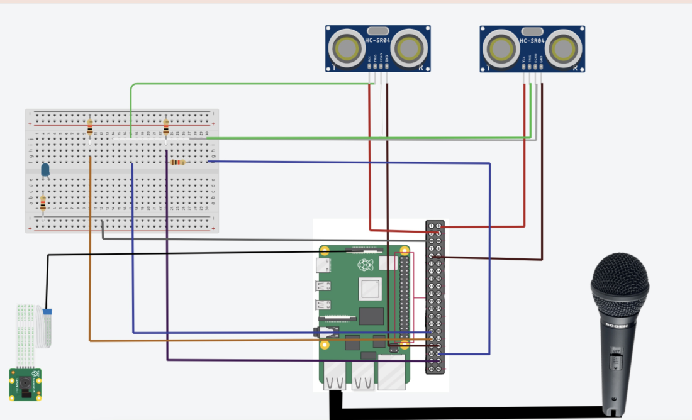

# Ball Tracking Robot
Hello everyone! I'm excited to share my latest project evolution: from a ball-tracking robot to a bike assistant designed to keep you safe and informed on the road. After repurposing the base and integrating ChatGPT with a Raspberry Pi as the brain, I've transformed it into a device that not only provides directions but also monitors your surroundings for safety.

Now, mounted on your bike, this assistant uses its capabilities to guide you to your destination. It can detect the distance of approaching cars and activate a warning light if they get too close, ensuring you stay aware and safe throughout your ride.

| **Engineer** | **School** | **Area of Interest** | **Grade** |
|:--:|:--:|:--:|:--:|
| Dejia L | Mission San Jose Highschool | Electronic Engineering | Incoming Sophmore


  
# Final Milestone

<iframe width="560" height="315" src="https://www.youtube.com/embed/F7M7imOVGug" title="YouTube video player" frameborder="0" allow="accelerometer; autoplay; clipboard-write; encrypted-media; gyroscope; picture-in-picture; web-share" allowfullscreen></iframe>

- I was able to intigrate ChatGBT into my raspberrypi
- What your biggest challenges and triumphs were at BSE, 
- I learned about how to code, what a raspberrypi even is, and the differences of where you put you wires in a breadboard
- I hope to learn cool things about engineering and get better and coding


# Second Milestone

<iframe width="560" height="315" src="https://www.youtube.com/embed/nUwmPCK7OmI?si=qDu0GlZ9UCoRzkPw" title="YouTube video player" frameborder="0" allow="accelerometer; autoplay; clipboard-write; encrypted-media; gyroscope; picture-in-picture; web-share" referrerpolicy="strict-origin-when-cross-origin" allowfullscreen></iframe>

- I added an led light to indicate how close the surroundings are which will help me when I attach it onto the bike instead othe red ball it's a car.
- What suprises me is how just a string of code could change something in real life, I find it very interesting.
- A previous challenge i faced was my raspberryp I stopped working so I had to redo a lot of codeing and re-wire everything
- I need to be able to attach it into my bike handle and add more ultra sonic sensors, and make it so im able to dissconect the power to the raspberry pi and it can run the code without me having to run it manually

# First Milestone

<iframe width="560" height="315" src="https://www.youtube.com/embed/kIg8PyAw-Cs?si=kNlMRi97fHzxuiml" title="YouTube video player" frameborder="0" allow="accelerometer; autoplay; clipboard-write; encrypted-media; gyroscope; picture-in-picture; web-share" referrerpolicy="strict-origin-when-cross-origin" allowfullscreen></iframe>

- I have motors and an ultrasonic sensor attached to my car and how they will work together is the motors will move the car around and the sensors will keep the car from crashing into anything.
- So far, I have been able to code the motors and the ultrasonica sensor, the motors will be able to move forward, back, left, and right. Thee ultrasonic sensor is able to measure any distance in its way up to around 200cm.
- Challenges I face in my future milestones are coding the camera to detect the red ball which i hope will be able to turn into cars soon.
- My plan is to be able to have multiple seismic snsors that pair with 1 or more cameras so i can attach everything to my bike which will tell me if a car goes into a specific area near my bike so i knowif I am safe or not, I also want to add something which will allow mt prject to connect to the internet and navigate me to where i want to go.

# Schematics 


# Code

```c++

import cv2  # OpenCV
from picamera2 import Picamera2, Preview
import RPi.GPIO as GPIO
import numpy as np
import time

GPIO.setmode(GPIO.BCM)
GPIO.setwarnings(False)

GPIO.setup(18, GPIO.OUT)

TRIG_1 = 16  # 23
ECHO_1 = 20  # 24
TRIG_2 = 5  # 23
ECHO_2 = 6  # 24

picam2 = Picamera2()
picam2.resolution = (160, 120)
picam2.framerate = 16
camera_config = picam2.create_still_configuration(main={"size": (1920, 1080)},
                                                  lores={"size": (640, 480)}, display="lores")
picam2.configure(camera_config)
picam2.start_preview(Preview.QTGL)
picam2.start()
time.sleep(2)

GPIO.setmode(GPIO.BCM)
GPIO.setup(17, GPIO.OUT)
GPIO.setup(22, GPIO.OUT)
GPIO.setup(23, GPIO.OUT)
GPIO.setup(24, GPIO.OUT)


def segment_colour(frame):
    hsv_roi = cv2.cvtColor(frame, cv2.COLOR_RGB2HSV)

    mask_1 = cv2.inRange(hsv_roi, np.array([150, 140, 1]), np.array([190, 255, 255]))

    mask = mask_1
    kern_dilate = np.ones((12, 12), np.uint8)
    kern_erode = np.ones((6, 6), np.uint8)
    mask = cv2.erode(mask, kern_erode)  # Eroding
    mask = cv2.dilate(mask, kern_dilate)  # Dilating

    (h, w) = mask.shape
    # print('h,w', h, w)

    # cv2.imshow('mask', mask) # Shows mask (B&W screen with identified red pixels)

    return mask


def find_blob(blob):
    largest_contour = 0
    cont_index = 0
    contours, hierarchy = cv2.findContours(blob, cv2.RETR_CCOMP, cv2.CHAIN_APPROX_SIMPLE)
    for idx, contour in enumerate(contours):
        area = cv2.contourArea(contour)
        if (area > largest_contour):
            largest_contour = area
            cont_index = idx

    r = (0, 0, 2, 2)
    if len(contours) > 0:
        r = cv2.boundingRect(contours[cont_index])

    return r, largest_contour


def sona(TRIG, ECHO):
    # print('Distance Measure in Progress')

    # Set pins as output and input
    GPIO.setup(TRIG, GPIO.OUT)
    GPIO.setup(ECHO, GPIO.IN)

    # Set trigger to False (Low)
    GPIO.output(TRIG, False)

    # print('Wait sensor to settle')
    time.sleep(0.000001)

    GPIO.output(TRIG, True)
    time.sleep(0.000001)
    GPIO.output(TRIG, False)

    while GPIO.input(ECHO) == 0:
        pulse_start = time.time()

    while GPIO.input(ECHO) == 1:
        pulse_end = time.time()

    pulse_duration = pulse_end - pulse_start
    distance = pulse_duration * 17150
    distance = round(distance, 2)
    # print('distance:', distance, 'cm')

    return distance


def reverse():
    GPIO.output(17, True)
    GPIO.output(22, False)
    GPIO.output(23, True)
    GPIO.output(24, False)


def forward():
    GPIO.output(17, False)
    GPIO.output(22, True)
    GPIO.output(23, False)
    GPIO.output(24, True)


def left():
    GPIO.output(17, False)
    GPIO.output(22, True)
    GPIO.output(23, True)
    GPIO.output(24, False)


def right():
    GPIO.output(17, True)
    GPIO.output(22, False)
    GPIO.output(23, False)
    GPIO.output(24, True)


def stop():
    GPIO.output(17, False)
    GPIO.output(22, False)
    GPIO.output(23, False)
    GPIO.output(24, False)


def led(seconds):
    # n = 0
    # while n<50:
    # print("LED on")

    for i in range(2):
        GPIO.output(18, GPIO.HIGH)
        time.sleep(seconds)
        # print("LED off")
        GPIO.output(18, GPIO.LOW)
        time.sleep(seconds)
        # n += 1


while (True):

    try:
        im = picam2.capture_array()
        height = im.shape[0]
        width = im.shape[1]

        hsv1 = cv2.cvtColor(im, cv2.COLOR_RGB2HSV)

        mask_red = segment_colour(im[:, :, [0, 1, 2]])

        loct, area = find_blob(mask_red)
        x, y, w, h = loct

        # print('x,y,w,h,area', x, y, w, h, area)
        # if area>1000: break

        # distance coming from  ultrasonic sensor
        distance_1 = sona(TRIG_1, ECHO_1)
        distance_2 = sona(TRIG_2, ECHO_2)

        if (w * h) < 10:
            found = 0
        else:
            found = 1
            simg2 = cv2.rectangle(mask_red, (x, y), (x + w, y + h), 255, 2)
            centre_x = x + ((w) / 2)
            centre_y = y + ((h) / 2)
            cv2.circle(mask_red, (int(centre_x), int(centre_y)), 3, (0, 110, 255), -1)
            # centre_x-=80
            # centre_y=6-centre_y
            # print('center', centre_x, centre_y)

        # initial = 400000000
        # flag = 0
        # print('found, area, distance', found, area, distance_1, found == 1, distance_1 < 10)

        if found == 0:
            # if the ball is not found and the last time it sees ball in which direction, it will start to rotate in that direction
            # if flag == 0:
            #     right()
            #     time.sleep(0.001)
            # else:
            #     left()
            #     time.sleep(0.05)
            stop()
            time.sleep(0.00125)
        elif found == 1:
            if distance_1<20 or distance_2<20:
                stop()
                time.sleep(0.00001)
            else:
            # elif distance_1 < 40 or distance_2 < 40:
                print('distance_1',distance_1, 'distance_2', distance_2)
                if distance_1 < 10 or distance_2 < 10:
                    led(0.25)

                # move to left if the ball is in the left
                if centre_x <= width // 4: # distance_1+50<distance_2 or 
                    print('case 1')
                    left()
                    time.sleep(0.2)
                    print('left')
                    forward()
                    time.sleep(0.02)
                    # print('forward')
                    stop()
                    time.sleep(0.00001)
                elif centre_x >= width // 4 * 3: # distance_2+50<distance_1 or 
                    print('case 2')
                    right()
                    time.sleep(0.2)
                    print('right')
                    forward()
                    time.sleep(0.02)
                    # print('forward')
                    stop()
                    time.sleep(0.00001)
                else:
                    print('case 3')
                    forward()
                    time.sleep(0.5)
                    print('forward')
                    stop()
                    time.sleep(0.000001)
    except Exception as e:
        print(e)
  import speech_recognition as sr
# import pyaudio
import openai
import pyttsx3
from gtts import gTTS
from io import BytesIO
from pygame import mixer
import os
import time
import warnings
warnings.filterwarnings('ignore')

from openai import OpenAI

# completion = client.completions.create(model='curie')
# print(completion.choices[0].text)
# print(dict(completion).get('usage'))
# print(completion.model_dump_json(indent=2))


def get_completion(prompt, model="gpt-3.5-turbo"):
    role = 'assistant'
    # system_prompt = 'You are school counselor for grade 9. You are very friend and informative. ' \
    # 'Your job is to help students and parents on all sorts of course work and school related questions. '
    system_prompt = 'You are a map assistant who provide detailed directions to users with patient and being friendly.'

    messages = [{"role": role, "content": system_prompt + prompt}]
    # response = client.ChatCompletion.create(
    response = client.chat.completions.create(
        model=model,
        messages=messages,
        temperature=0,
    )

    # return response.choices[0].message["content"]
    return response.choices[0].message.content

def speak(text):
    mp3_fp = BytesIO()
    tts = gTTS(text=text, lang='en', slow=False)
    tts.write_to_fp(mp3_fp)

    mixer.init()
    mp3_fp.seek(0)
    mixer.music.load(mp3_fp, "mp3")
    mixer.music.play()
    while mixer.music.get_busy() == True:
        continue
    time.sleep(1)

# def get_chinese_voice(engine):
#     """Get a Chinese voice"""
#     voices = engine.getProperty("voices")
#     for voice in voices:
#         if "zh_CN" in voice.languages:
#             return voice
#         if "Chinese" in voice.name or "Mandarin" in voice.name.title():
#             return voice
#
#     raise KeyError(f"No Chinese voice found among {voices}")


# initialize voice recognizer
recognizer = sr.Recognizer()

# initialize text to voice engine
# engine = pyttsx3.init()
# engine.setProperty("rate", 60)  # Speed of speech (words per minute)
# engine.setProperty("volume", 0.8)
# chinese_voice = get_chinese_voice(engine)
# engine.setProperty("voice", chinese_voice.id)

# initialize ChatGPT
# openai.api_key = "" #bewtween the quotations should be the secret key 

client = OpenAI(
  api_key="" #secret key
 #os.environ['OPENAI_API_KEY'],  # this is also the default, it can be omitted
)

# chat begins
while True:
    print('---------------------')
    # ready_to_talk = input('Have a question (y/n)?')
    time.sleep(2)
    speak('How can I help you')
    # if ready_to_talk != 'y':
    #     continue

    with sr.Microphone() as source:
        print("Listening...")
        audio = recognizer.listen(source)

    try:
        prompt = recognizer.recognize_google(audio)
        print("You said:", prompt)
    except sr.UnknownValueError:
        speak("Sorry, I could not understand.")
        continue

    response = get_completion(prompt)
    print(response)

    

    # hear_answer = input('Ready to hear the answer (y/n)?')
    # if hear_answer != 'y':
    #     continue

    # print('')
    # print(hear_answer.replace('. ', '. \n'))

    # if hear_answer:
    speak(response)
    # engine.say(response)
    # engine.runAndWait()

    if 'quit' in prompt.lower():
        break


}
```

# Bill of Materials

| **Part** | **Note** | **Price** | **Link** |
|:--:|:--:|:--:|:--:|
| Raspberry Pi Kit | A small computer set | $95.19 |[Link](https://www.amazon.com/RasTech-Raspberry-Starter-Heatsink-Screwdriver/dp/B0C8LV6VNZ/ref=sr_1_4?crid=3506HY00MCGVM&dib=eyJ2IjoiMSJ9._zkM62vSQ8p7tNr88715LdMv_qHh72Je-tkF9PXEa3chDE53QT4aZu4AGAb4ihE61QY4ZD55nKF6Fp2Kfs8t7AbafM_JrlJFfHo9OB4eAVGqa0EB-7aoBQHPmhKHZ2MW8ny-Kd44bMVlVxPlTWVk5YHIN5P3uKVqrE5Dcal0rKkHny-O6Xyb5ux2AOU6OwVbkag_bqBX66RQNRrgBuz-0pS43mcx93IZTQA9R8NaJJypYU2HAycp-XicTFmyU60a01Nfm9iuyo6B9yA8ppN3OQQyJ-NQ9xyNPxfTLwkqtng.yAYpU6outhQcZmOZhN9Wb6yTw7A85CNUbXZguGInZNg&dib_tag=se&keywords=raspberry%2Bpi%2Bkit&qid=1718848547&s=electronics&sprefix=rasbperry%2Bpi%2Bkit%2Celectronics%2C83&sr=1-4&th=1) |
| Robot Chassis | The car that moves around everything | $18.99 |  [Link](https://www.amazon.com/Smart-Chassis-Motors-Encoder-Battery/dp/B01LXY7CM3/ref=sr_1_5?crid=373Y5YK6JWMD&keywords=robot+chassis&qid=1687740144&sprefix=robot+chassi%2Caps%2C93&sr=8-5) |
| Screwdriver Kit | Used to screw in nails and unscrew them | $5.94 | [Link](https://www.amazon.com/Small-Screwdriver-Set-Mini-Magnetic/dp/B08RYXKJW9/) |
| Ultrasonic Sensor | Measure distances infront of it | $9.99 | [Link](https://www.amazon.com/WWZMDiB-HC-SR04-Ultrasonic-Distance-Measuring/dp/B0CQCCGXCP/ref=sr_1_1_sspa?crid=3J2JR973WKPHO&dib=eyJ2IjoiMSJ9.E2SIkElJhtFWCJCHL5Q6Y73Ys_HCMPRVFCIrG_zKv4Og7BdZNtr69Mkju140lhlfzFGQuY542jpsp8FMrtV9d2hCBI7D8lYTH9bcgDXZhs4941uj-d1D69ZYdKmAI1Jig3VmYXOl3axVQ8Jq5L3nGRymNMtNbxkaFqGNyzkq4p37hhxU6jheuoaMo3Onz2FE9ILThkjUbdxRNW3rrZgZ7bYj9mf-yav85hBAmNduYyo.EneY3GmHDfDjDwhdUdDQ4Ktk6fECH62Adb42cEkehRc&dib_tag=se&keywords=ultrasonic%2Bsensor&qid=1715961326&sprefix=ultrasonic%2Bsensor%2Caps%2C72&sr=8-1-spons&sp_csd=d2lkZ2V0TmFtZT1zcF9hdGY&th=1) |
| H Bridges | Control the motors | $7.79 |  [Link](https://www.amazon.com/HiLetgo-H-bridge-Stepper-Controller-Arduino/dp/B00M0F243E/ref=pd_lpo_sccl_1/142-4739935-9789822?pd_rd_w=5sLcA&content-id=amzn1.sym.4c8c52db-06f8-4e42-8e56-912796f2ea6c&pf_rd_p=4c8c52db-06f8-4e42-8e56-912796f2ea6c&pf_rd_r=KR0X36CCWH30E7T108Y9&pd_rd_wg=1cZ0l&pd_rd_r=420e26d6-ea71-4fc7-adcf-6cf8ffb38079&pd_rd_i=B00M0F243E&psc=1) |
| Pi Cam | A small camera | $12.86 | [Link](https://www.amazon.com/gp/product/B07RWCGX5K/ref=ox_sc_act_title_1?smid=A2IAB2RW3LLT8D&psc=1) |
